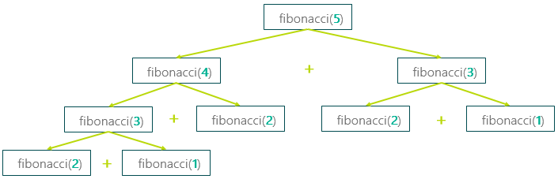
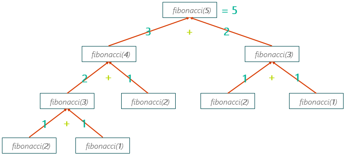

# Recursive Algorithms

Any Java method has a very interesting ability: it can call itself! This capability is called recursion, and it is an extremely powerful way to solve some kinds of computing problems.In fact, it’s the most natural way to do things like searching your computer for a specific file, or finding the best way to get from one place to another on a road map.

It’s another way of writing code so that repeats over and over, just as looping (formally known as iteration) does. Some programming languages don't even have loops – they only use recursion to repeat code. Recursion got its start in mathematics a long time before computers; you may have learned about inductive proofs in geometry dating back to Plato, or, more recently, recursively defined functions in algebra.

Coding with Recursion
Let’s look at an example: computing the factorial of a number. A factorial is a mathematical sum of all preceding ints. For example 5! = 54321.

Here is how we would use a loop to calculate this:

public static int factorial(int n) {
    int result = 1;
    for (int i = 2; i <= n; i++) {
        result *= i;
    }
    return result;
}
We can also code this using recursion. The secret to thinking recursively is "how can I break this down to simpler and simpler problems?"

In this case if you need to find 5!, you could first find 4! and then just multiply that by 5, but let's not stop there. To find 4! you could find 3! and just multiply that by 4. And so on until you get to the very simplest problem- 1! = 1.

factorial(5) = 5 * factorial(4)
factorial(4) = 4 * factorial(3)
factorial(3) = 3 * factorial(2)
factorial(2) = 2 * factorial(1)
factorial(1) = 1
Looking at the pattern, we could generalize it as:

factorial(n) = n * factorial(n-1)
Now let's turn this into code:

public static int factorial(int n) {
    if (n == 1) {
        return 1;
    } else {
        return n * factorial(n-1);
    }
}
The first return, inside the if statement is called the "base case": it’s the smallest possible version of the computation, the one that’s "easy", or the "end of the recursion".

Inside the else is the recursive case where we’ve made the problem smaller before passing it onto the next method call recursively.

As this suggests, a recursive method always needs:

A base case that returns a value without calling itself. This is how you know your recursion will actually stop.
A recursive case that makes the problem smaller, and then calls itself recursively to solve the smaller problem. You have to make sure your recursive case moves your parameter closer to the base case, otherwise you might recurse for forever.
In some cases, you may have several base cases, and the recursive case may make multiple recursive calls and/or different calls depending on the values passed in.

The Fibonacci sequence is an example of a naturally occurring recursive algorithm. It involves multiple base cases and multiple recursive calls. In this sequence, each number is the sum of the previous two, starting with 1 and 1:

Fibonacci(1) = 1 = base case
Fibonacci(2) = 1 = base case
Fibonacci(3) = 2 = 1 + 1
Fibonacci(4) = 3 = 1 + 2
Fibonacci(5) = 5 = 3 + 2
Fibonacci(6) = 8 = 5 + 3
You can see this as a pattern:

fibonacci(n) = fibonacci(n-1) + fibonacci(n-2)
Which represents the recursive case, because it breaks the problem down into smaller and smaller versions of itself.

To code this we need two base cases, since we have to know first two numbers in the sequence to get it started:

fibonacci(1) = 1
fibonacci(2) = 1
If we combine the recursive case and the base case we get the following solution:

public static int fibonacci(int n) {
    if (n == 1) {
        return 1;
    } else if (n == 2) {
        return 1;
    } else {
        return fibonacci(n-1) + fibonacci(n-2);
    }
}
In all recursive methods, if the base case is missing, or if the recursive case can ever call itself with the same problem (same values of the parameters), it can call itself forever. In Java, this results in a “stack overflow” error eventually when it runs out of memory on the computer.

# Recursive Tracing
Recursive Tracing
It takes practice for most people to get comfortable “thinking recursively”. Tracing recursive algorithms as they work is a good way of getting comfortable with how this method works. We could do this by writing out the formulas, one after another, like we did for factorial in the previous section:

factorial(5) = 5 * factorial(4)
factorial(4) = 4 * factorial(3)
factorial(3) = 3 * factorial(2)
factorial(2) = 2 * factorial(1)
factorial(1) = 1
However, this can get very long winded. To make recursive tracing simpler we can do the same thing in an abbreviated table that shows the value passed to each recursive call in order:

n	factorial(n)
5	5 * f(4)
4	4 * f(3)
3	3 * f(2)
2	2 * f(1)
1	1
Once we reach the base case, we have reached the end of our table. To get our final result we simulate each return by filling in values from the bottom up back up to the top row like so:

n	  call	    return	result
5	5 * f(4)	5 * 24	120
4	4 * f(3)	4 * 6	24
3	3 * f(2)	3 * 2	6
2	2 * f(1)	2 * 1	2
1	1	1	1
Then we find the final result on the top row of the table, in this case 120.

When you have a recursive solution with multiple recursive calls each one kicks off it's own table, which can be hard to keep track of. This is because for each call you have two more recursive calls to make, and each of those have two more recursive calls and so on... Instead of a linear table you can visualize this like a tree that branches out as it moves down towards the base case.

Let's take Fibonacci from the last section:

public static int fibonacci(int n) {
    if (n == 1) {
        return 1;
    } else if (n == 2) {
        return 1;
    } else {
        return fibonacci(n-1) + fibonacci(n-2);
    }
}
Here is a "tree" of recursion for fibonacci(5):

a tree representation of recursive calls for fibonacci

You can see quickly that this single call results in 8 further recursive calls until the base cases of 2 and 1 are reached. Filling in the base cases and then propagating those values upward shows how the final result of 5 is reached:

